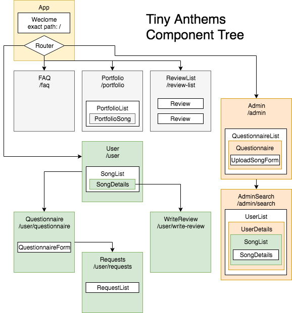
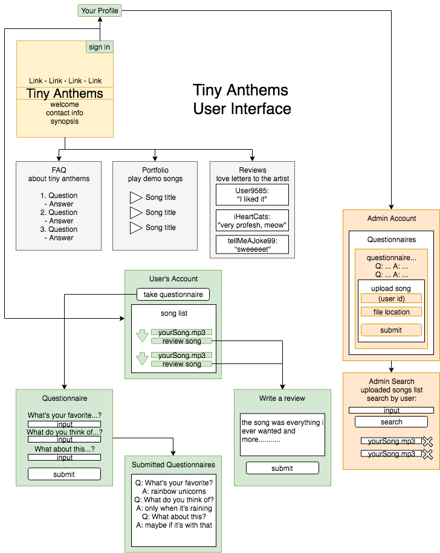

# Tiny Anthems
## Songs about you
*by Chris Knight Johnson*

## Description
This React web app was created for local Portland musician Mike Long. Using Google Web Services, visitors in need of a personalized song about their life, or in need of a song to serenade a loved one, can fill out a questionnaire that will be saved in Google's cutting edge Firestore database. The musician/minstrel can then sign in as an admin to retrieve the questionnaires for direction in song creation, and then post his client's completed song on Google Storage for download.

This web app allows:

...a visiting user to:
* read information about the musician's service
* login with a Google account
* fill out a questionnaire for themselves or another person to receive custom song
* retrieve song from their profile once completed and uploaded by musician (admin)

...the musician (admin) to:
* login to see pending questionnaires
* upload a song file to that specific questionnaire for client retrieval


## Technology
* Facebook [create-react-app](https://github.com/facebook/create-react-app)
* ~~Material UI~~ not yet implemented
* Google [SDK](https://cloud.google.com/sdk)
* Google [Cloud Storage](https://cloud.google.com/)
* Google [Firestore Database](https://firebase.google.com/docs/firestore/)
* Google [Firebase Authentication](https://firebase.google.com/docs/auth/)
* [Firestorter](https://github.com/IjzerenHein/firestorter), an incredible Firestore reference and live-update library
* [MobX](https://mobx.js.org/index.html), state management and Observables for use with Firestorter
* [js-file-download](https://www.npmjs.com/package/js-file-download), library for blob downloading thru browsers to local drive

# Progress
### Protocol
- [ ] PropType checking in all components
- [ ] Test cases for all components

### Authentication
- [x] Authenticate users with Google sign in
- [x] Use PrivateRoute function to restrict access to unlogged users
- [x] Redirect to /user Profile page after successful sign in
- [ ] Use AdminRoute to restrict admin access
- [ ] React Context used for auth
- [ ] Switch from PrivateRoute & AdminRoute to Auth HOC

### Database & Storage
- [ ] Google Cloud Storage is used to store static site files for hosting

##### Client
- [x] Submit questionnaire for song creation
- [x] View their completed songs
- [x] Download their songs
- [x] Store questionnaire answers in a nested object inside their quiz
- [ ] Redirect after successful quiz submission
- [ ] Two questionnaires: toggle quiz for either the client or for someone the client knows
- [ ] Review songs by posting to quiz document object

##### Admin
- [x] Display list of questionnaires
- [x] Upload songs to Google Cloud Storage
- [x] Database references saved song files as nested array in each quiz object
- [x] Admin can delete songs from questionnaires (removes reference from database and song file from storage)
- [x] Admin can sort pending questionnaires with collection queries
- [x] Display quiz questions and answers on admin view using Object.entries
- [ ] Admin checkbox to mark pending questionnaires as complete
- [ ] Automatically email client to notify of song completion

### UX & Interface
- [x] Display demo songs to play on portfolio page via Soundcloud imbeds
- [ ] Confirm quiz was submitted
- [ ] Contact Mike Long the minstrel via email
- [ ] Redesign site styles
- [ ] Material UI styles (is installed, but not yet implemented)

### Bugs
* Clicking upload on the admin page when there isn't a local file selected will crash the app

# Install
1. git clone
1. npm install
1. configure firebase via firebase web console
1. generate your own apikey on firebase console
1. place new api key in .env file in top directory as REACT_APP_APIKEY="AIexample123456789"
1. npm start
1. view at localhost:3000

# Structure



# Notes (misc & unorganized)

### firestorter & firebase connections
mapping out documents in a collection:
```javascript
const { docs, query } = someCollection;
const children = docs.map((doc) => <p key={doc.id}>doc.id is {doc.id}<br/>doc.data.name is {doc.data.name}</p>);
```
firestorter document properties
* doc.path
* doc.id
* doc.data.property

userDoc.fetch().then(({data}) => console.log(data.snapshot));

firebase.auth result
* signInWithPopup returns result
  * (result) => result.user.uid

### firestore (vanilla)
const docRef = firebase.firestore().collection("users").doc("12345");
docRef.get().then(doc => console.log(doc.data()))

### two way data binding
```javascript
onTextChange = (event) => {
  this.setState({
    songTitle: event.target.value
  });
};

<label>songTitle:</label>
<input type="text" onChange={this.onTextChange} value={this.state.songTitle || ''} />
```
